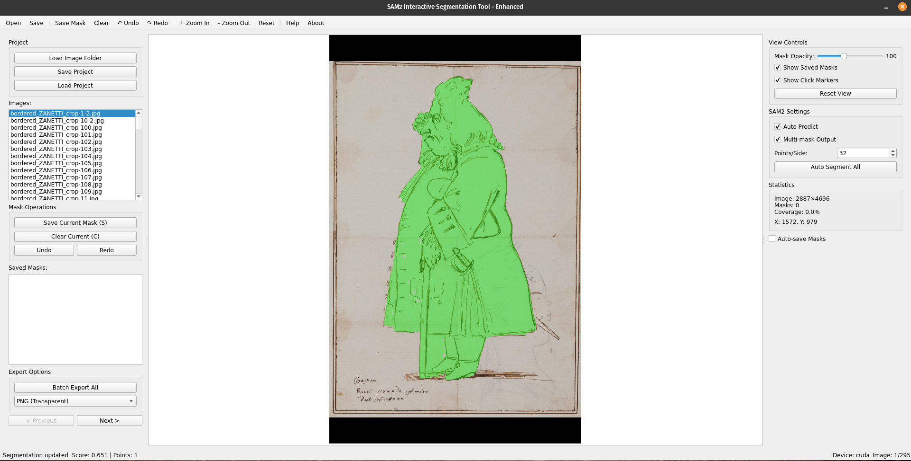

# SAM2 Interactive Segmentation Tool

Un'applicazione PyQt5 avanzata per la segmentazione interattiva di immagini usando Segment Anything Model 2 (SAM2) di Meta.



## Caratteristiche

- 🎯 **Segmentazione Interattiva**: Clicca per aggiungere/rimuovere regioni con anteprima in tempo reale
- 🎨 **Supporto Multi-maschera**: Crea maschere multiple per immagine con colori diversi
- 💾 **Gestione Progetti**: Salva e carica interi progetti di segmentazione
- 📦 **Export Batch**: Esporta tutte le maschere in formato PNG/JPG
- ↩️ **Undo/Redo**: Supporto completo della cronologia per le operazioni sulle maschere
- 🔍 **Zoom & Pan**: Naviga immagini grandi con facilità
- ⚡ **Ottimizzato per Performance**: Cache e supporto accelerazione GPU

## Prerequisiti

- Python 3.10 o superiore
- GPU con supporto CUDA (opzionale, ma raccomandato)
- Conda o Miniconda installato
- Almeno 8GB RAM (16GB raccomandati)
- ~4GB di spazio su disco per i pesi del modello

## Installazione

### Passo 1: Crea l'Ambiente Conda

```bash
# Crea un nuovo ambiente conda con Python 3.10
conda create -n sam2app python=3.10 -y

# Attiva l'ambiente
conda activate sam2app
```

### Passo 2: Installa PyTorch

Per supporto GPU (raccomandato):
```bash
# Installa PyTorch con supporto CUDA
conda install pytorch torchvision torchaudio pytorch-cuda=11.8 -c pytorch -c nvidia
```

Solo per CPU:
```bash
# Installa versione CPU di PyTorch
conda install pytorch torchvision torchaudio cpuonly -c pytorch
```

### Passo 3: Installa le Dipendenze

```bash
# Installa PyQt5 (deve essere installato PRIMA di opencv)
pip install PyQt5

# Installa OpenCV headless (per evitare conflitti Qt)
pip install opencv-python-headless

# Installa numpy
pip install numpy

# Installa SAM2
pip install git+https://github.com/facebookresearch/segment-anything-2.git
```

### Passo 4: Scarica il Modello SAM2

```bash
# Crea la directory checkpoints
mkdir -p checkpoints

# Scarica il modello large (raccomandato)
wget https://dl.fbaipublicfiles.com/segment_anything_2/072824/sam2_hiera_large.pt -O checkpoints/sam2_hiera_large.pt

# Alternativa: Scarica il modello più piccolo per minore uso di VRAM
# wget https://dl.fbaipublicfiles.com/segment_anything_2/072824/sam2_hiera_small.pt -O checkpoints/sam2_hiera_small.pt
```

### Passo 5: Crea la Directory del Progetto

```bash
# Crea la directory del tuo progetto
mkdir image_segmentation_app
cd image_segmentation_app

# Copia il file main.py qui
# Assicurati che main.py sia in questa directory
```

## Utilizzo

### Avviare l'Applicazione

```bash
# Assicurati di essere nella directory del progetto
cd image_segmentation_app

# Attiva l'ambiente conda
conda activate sam2app

# Esegui l'applicazione
python main.py
```

### Workflow di Base

1. **Carica Immagini**
   - Clicca "Load Image Folder" per selezionare una directory contenente immagini
   - Formati supportati: PNG, JPG, JPEG, BMP, TIFF, WEBP

2. **Crea Maschere**
   - **Click Sinistro**: Aggiungi regione alla maschera (punto positivo)
   - **Click Destro**: Rimuovi regione dalla maschera (punto negativo)
   - La maschera si aggiorna automaticamente dopo ogni click
   - La maschera corrente appare in verde

3. **Salva Maschera**
   - Premi 'S' o clicca "Save Current Mask" quando sei soddisfatto
   - Le maschere salvate appaiono in colori diversi (rosso, blu, giallo, ecc.)
   - Crea maschere multiple per immagine

4. **Navigazione**
   - Usa i tasti freccia o i pulsanti di navigazione per muoverti tra le immagini
   - Premi Spazio per l'immagine successiva, Backspace per la precedente

5. **Esporta Risultati**
   - Clicca "Batch Export All" per esportare tutte le maschere
   - Scegli il formato: PNG (con trasparenza), JPG (maschera binaria), o Entrambi
   - Gli export sono organizzati in cartelle: `png_masks/`, `jpg_masks/`, `backgrounds/`

### Scorciatoie da Tastiera

| Scorciatoia | Azione |
|-------------|--------|
| **S** | Salva maschera corrente |
| **C** | Cancella maschera corrente |
| **Ctrl+Z** | Annulla ultima azione |
| **Ctrl+Y** | Ripristina |
| **Spazio** | Immagine successiva |
| **Backspace** | Immagine precedente |
| **Canc** | Elimina maschera salvata selezionata |
| **R** | Ripristina vista |
| **H** | Mostra/nascondi maschere |
| **Ctrl+O** | Apri cartella |
| **Ctrl+S** | Salva progetto |
| **Ctrl+E** | Export batch |
| **F1** | Mostra aiuto |

### Controlli Mouse

- **Click Sinistro**: Aggiungi alla maschera
- **Click Destro**: Rimuovi dalla maschera
- **Tasto Centrale**: Pan della vista
- **Ctrl + Scroll**: Zoom avanti/indietro

## Funzionalità Avanzate

### Gestione Progetti

Salva l'intera sessione di segmentazione:
```
1. Clicca "Save Project" o premi Ctrl+S
2. Tutte le maschere e impostazioni sono salvate nella directory del progetto
3. Carica il progetto successivamente per continuare da dove hai lasciato
```

### Salvataggio Automatico

Abilita il salvataggio automatico per non perdere mai il lavoro:
```
1. Spunta "Auto-save Masks" nel pannello destro
2. Le maschere sono salvate automaticamente quando cambi immagine
```

### Opacità Maschere

Regola la trasparenza delle maschere:
```
1. Usa lo slider opacità in "View Controls"
2. Range: 0 (trasparente) a 255 (opaco)
```

### Auto-Segmentazione

Rileva automaticamente tutti gli oggetti:
```
1. Clicca "Auto Segment All"
2. Regola "Points/Side" per la densità (più alto = più oggetti)
3. Attendi il completamento dell'elaborazione
```

## Risoluzione Problemi

### Errore Qt Platform Plugin

Se vedi "Could not load the Qt platform plugin":
```bash
# Usa opencv-headless invece
pip uninstall opencv-python opencv-contrib-python
pip install opencv-python-headless
```

### CUDA Out of Memory

Se ricevi errori di memoria GPU:
```bash
# Usa CPU invece (più lento ma funziona)
# L'app passerà automaticamente a CPU se CUDA non è disponibile
```

O usa un modello più piccolo:
```python
# In main.py, cambia il percorso del checkpoint in:
checkpoint = "checkpoints/sam2_hiera_small.pt"
```

### Modello Non Trovato

Se il file del modello non è trovato:
```bash
# Assicurati di essere nella directory giusta e scarica il modello
ls checkpoints/  # Dovrebbe mostrare sam2_hiera_large.pt
# Se no, riscarica:
wget https://dl.fbaipublicfiles.com/segment_anything_2/072824/sam2_hiera_large.pt -O checkpoints/sam2_hiera_large.pt
```

### Errori di Import

Se ricevi errori di import:
```bash
# Assicurati di usare l'ambiente giusto
conda activate sam2app
which python  # Dovrebbe mostrare il percorso con sam2app
```

## Consigli per Risultati Migliori

1. **Click Multipli**: Usa più click positivi intorno al bordo dell'oggetto per maggiore accuratezza
2. **Raffinamento**: Alterna click positivi e negativi per rifinire i bordi
3. **Zoom**: Usa Ctrl+Scroll per ingrandire e cliccare con precisione sui bordi
4. **Salva Spesso**: Salva le maschere frequentemente, specialmente per segmentazioni complesse
5. **Codifica Colori**: Verde = maschera corrente in modifica, Altri colori = maschere salvate

## Struttura Output

Dopo l'export batch, la tua directory di output conterrà:
```
directory_output/
├── png_masks/          # Maschere PNG trasparenti
│   ├── image1_mask_1.png
│   ├── image1_mask_2.png
│   └── ...
├── jpg_masks/          # Maschere JPG binarie
│   ├── image1_mask_1.jpg
│   ├── image1_mask_2.jpg
│   └── ...
└── backgrounds/        # Regioni di sfondo (aree non in nessuna maschera)
    ├── image1_bg.png
    └── ...
```

## Requisiti di Sistema

### Minimi
- CPU: 4 core
- RAM: 8GB
- GPU: Nessuna (modalità CPU)
- Storage: 5GB liberi

### Raccomandati
- CPU: 8+ core
- RAM: 16GB+
- GPU: NVIDIA con 8GB+ VRAM
- Storage: 10GB liberi

## Consigli per le Performance

1. **Usa GPU**: Significativamente più veloce della CPU (10-50x speedup)
2. **Chiudi altre applicazioni**: Libera RAM e VRAM
3. **Elaborazione batch**: Processa più immagini insieme con auto-segmentazione
4. **Riduci risoluzione**: Ridimensiona immagini molto grandi prima dell'elaborazione

## Licenza

Questo strumento usa SAM2 che è licenziato sotto licenza Apache 2.0 da Meta.

## Supporto

Per problemi, domande o contributi, fare riferimento al repository del progetto.

## Ringraziamenti

- Meta AI per il modello SAM2
- PyQt5 per il framework GUI
- La comunità open-source

---

**Nota**: Questo strumento è per scopi di ricerca ed educativi. Assicurati di avere il diritto di elaborare e modificare qualsiasi immagine usi con questo strumento.
